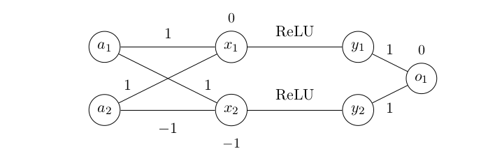

We basically copy the file format of Ehlers (which is also used by Bunel et al.). Therefore an explanation can be found in the section "PLANET specification files" in https://github.com/progirep/planet/blob/master/README.md. We only make a slight change to the description of input and output constraints, which allows to model different types of instances. 

Each input file contains an entire instance of the verification problem, i.e. both the neural network which shall be investigated, and the corresponding input and output properties. The structure is the following:
1. Definition of the input neurons
2. Definition of the neural network
3. Definition of input constraints
4. Defintions of output constraints

Lines starting with "#" are ignored. The following lines are the first part of a valid input file. 
```
Input a1
Input a2
ReLU y1 0.0 1.0 a1 1.0 a2
ReLU y2 -1.0 1.0 a1 -1.0 a2
Linear o1 0.0 1.0 y1 1.0 y2
```
These lines describe the following neural network:


The ReLU input neurons x1 and x2 are not referred to explicitly in the description. To obtain a complete test instance, the input and output constraints must be added. If we impose contraints -3 <= a1 <= 2 and -5 <= a2 <= 4 for the input values, we could try to verify that o1 < 3. The output constraint must then be inverted. It is equivalent to verifying that o1 < 3 if we show that no solution with 3 <= o1 exists. The following lines are appended to those which represent the neural network:
```
Assert <= -3.0 1.0 a1
Assert >= 2.0 1.0 a1
Assert <= -5.0 1.0 a2
Assert >= 4.0 1.0 a2
AssertOut <= 3.0 1.0 o1
```

It is not necessary that input or output constraints contain only one variable, there can be arbitrarily many. The order is always (cf. https://github.com/progirep/planet/blob/master/README.md)
```
Assert(Out/Or)    <=/>=     bias    coefficient   variable  coefficient    variable  ...
```
If several lines with AssertOut are present, a valid counterexample for the instance must fulfill all the corresponding constraints. If several lines with AssertOr are present, a valid counterexample for the instance must fulfill only one of the corresponding constraints. Currently, our implementation is restricted such that AssertOr and AssertOut cannot be mixed in one instance. AssertOr corresponds to conjunction instances, AssertOut to disjunction instances (see Remark 7 in the Master's thesis).

Many examples can be found in the folder benchmarks/scip. The instances in the subfolder linear_acas feature also input properties, that are general linear constraints.
